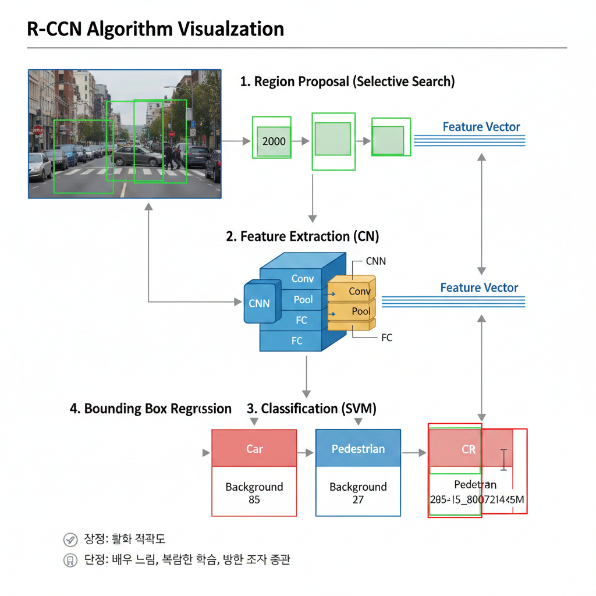
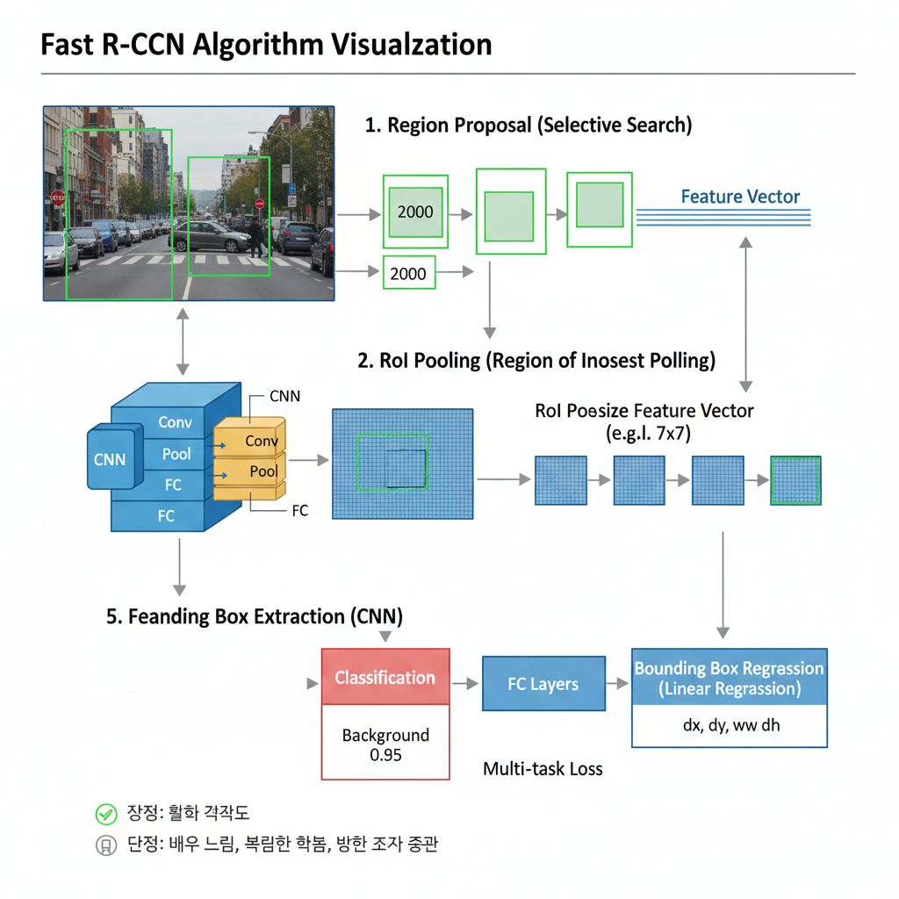
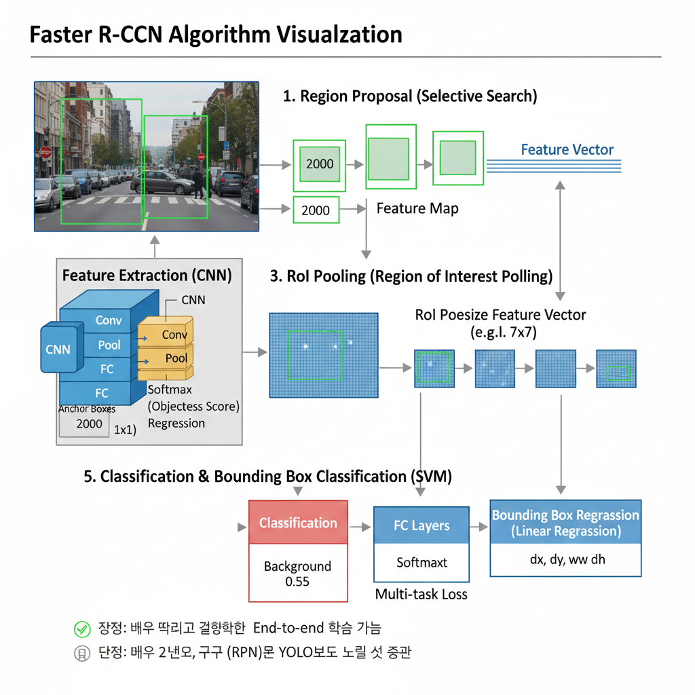
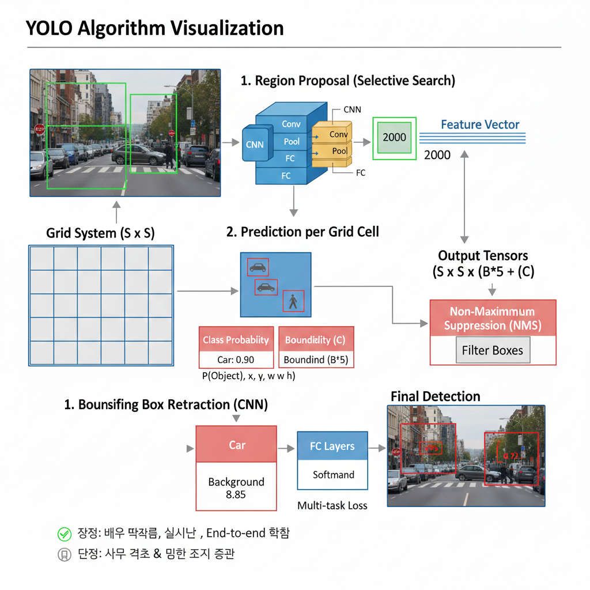
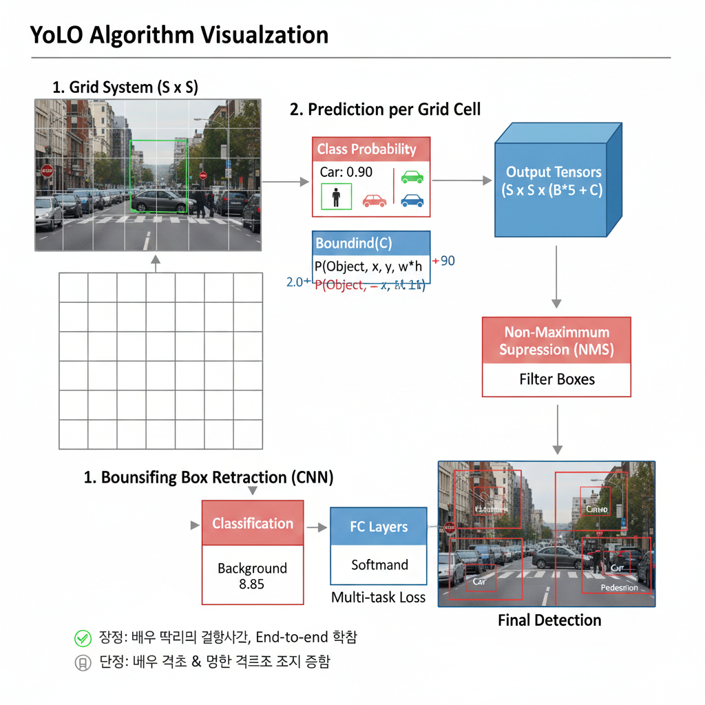
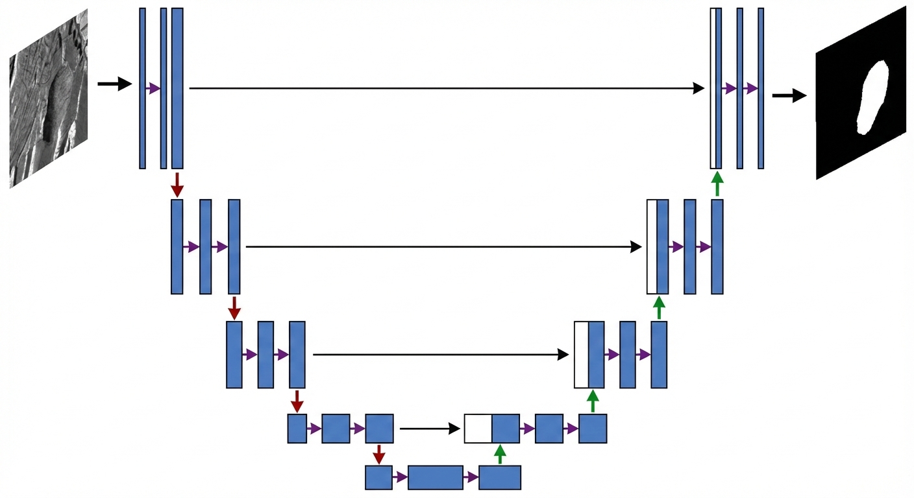
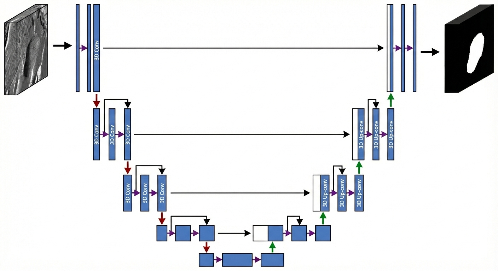
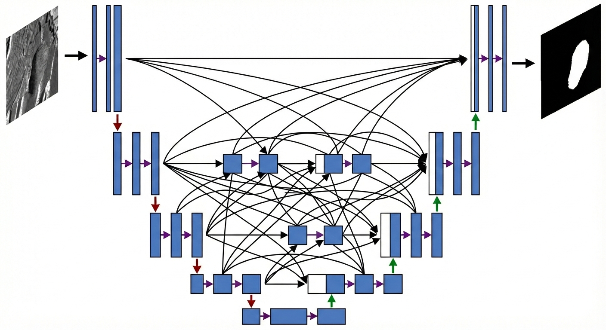
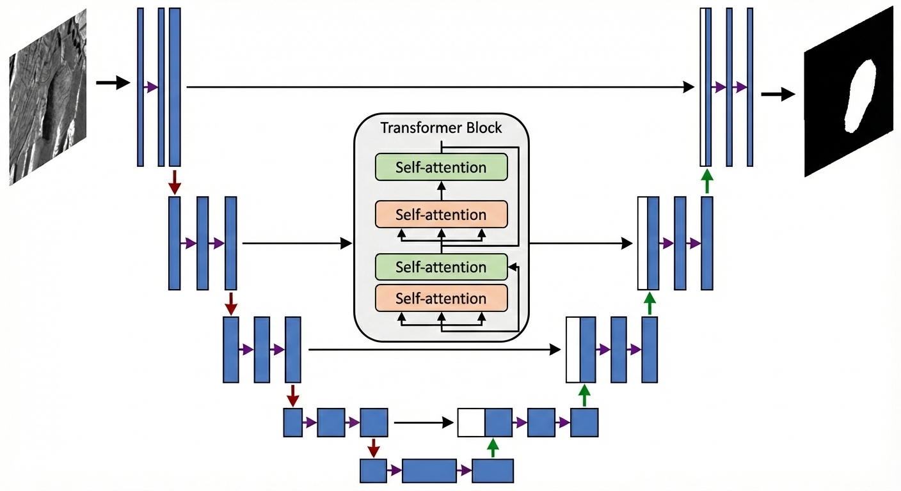
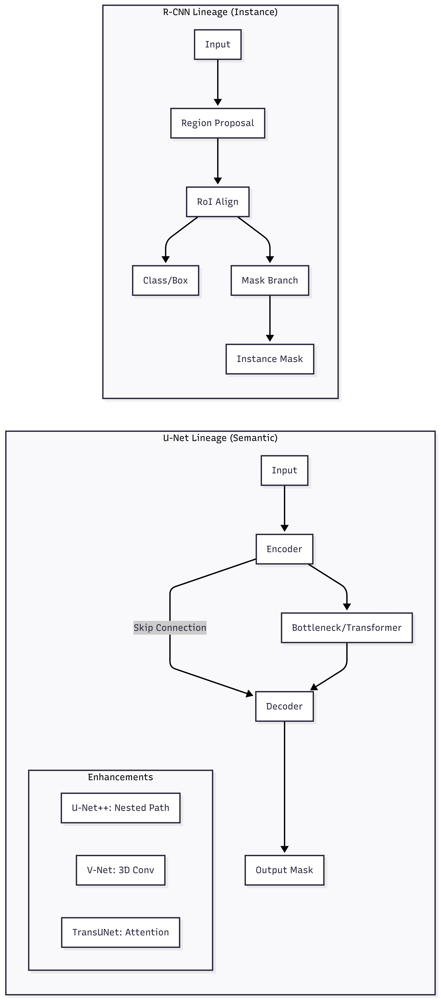

# 👁️ Multi-task Vision: Object Detection & Segmentation


> **Object Detection과 Segmentation을 동시에 수행하는 멀티태스크 비전 모델 개발**
> 의료 영상(내시경 데이터)을 활용하여 실전 문제 해결을 목표로 한 **팀 기반 포트폴리오 프로젝트**입니다.

---

## 🚀 Key Features

본 프로젝트는 단일 모델 내에서 두 가지 비전 태스크를 효율적으로 처리하기 위해 다음과 같은 기능을 구현했습니다.

* **Multi-task Learning:** Object Detection + Segmentation 동시 학습 구조 설계
* **Data Pipeline:** COCO-style annotation 파싱 및 전처리 자동화
* **Loss Function:**
    * **Detection:** IoU 기반 Bounding Box Loss
    * **Segmentation:** BCE(Binary Cross Entropy) + Dice Loss 결합
* **Experiment Mgmt:** YAML Config 기반의 유연한 실험 관리
* **Modular Code:** 유지보수와 확장이 용이한 모듈형 구조 (`src/` 분리)
* **Reproducibility:** Docker를 이용한 동일한 실행 환경 보장

---

## 🛠 Tech Stack

프로젝트에 사용된 주요 기술 스택입니다.

| Category | Technology |
| :--- | :--- |
| **Framework** |  |
| **Vision Libs** |   |
| **Environment** |  |


## 📁 Project Structure

```text
Edoscopic_images_cv_project/
│
├── data/                  # 데이터셋 (AI Hub 다운로드 후 정리)
├── models/
│   ├── fast_rcnn.py       # Object Detection 모델 정의
│   ├── unet.py            # Segmentation 모델 정의
│   └── multitask.py       # 두 모델을 합친 멀티태스킹 구조
│
├── utils/
│   ├── dataset.py         # 데이터 로더 (Detection + Segmentation 라벨 처리)
│   └── metrics.py         # IoU, Dice, mAP 등 평가 지표
│
├── train.py               # 학습 루프
├── eval.py                # 평가 스크립트
├── inference.py           # 추론 스크립트
├── README.md              # 프로젝트 문서
└── requirements.txt       # 필요한 라이브러리


```

---

## 🧱 Hardware Environment

실험 및 학습은 아래 환경에서 진행되었습니다.

| Component | Specification |
| :--- | :--- |
| **GPU** | NVIDIA RTX 4060 Ti (8GB) |
| **CUDA** | Version 11.7 |
| **CPU** | AMD Ryzen 5 5600 6-core |
| **RAM** | 16GB |

---

## 🐳 How to Run (Docker)

Docker를 사용하여 복잡한 환경 설정 없이 바로 프로젝트를 실행할 수 있습니다.

### 1. Build Image
```bash
docker build -t multitask-vision .
docker run --gpus all -it multitask-vision
```

---

# 객체 탐지 모델 아키텍처 비교 (Object Detection Architecture Comparison)

R-CNN 계열(2-Stage)의 발전 과정과 YOLO(1-Stage)의 구조적 차이를 보여주는 비교 다이어그램입니다.

# Object Detection Models Comparison

## R-CNN
- Region Proposal 기반 객체 검출
- Selective Search로 영역 생성
- CNN을 각 영역마다 적용 → 매우 느림

## Fast R-CNN
- 전체 이미지를 한 번만 CNN에 통과
- RoI Pooling 도입
- End-to-End 학습 가능

## Faster R-CNN
- Region Proposal Network (RPN) 도입
- Selective Search 제거
- 높은 정확도의 Two-stage Detector

## YOLO
- 객체 검출을 하나의 회귀 문제로 해결
- 매우 빠른 속도
- 실시간 객체 검출 가능

# 객체 탐지 알고리즘: R-CNN, Fast R-CNN, Faster R-CNN, YOLO 비교

이 문서는 객체 탐지(Object Detection) 분야의 대표적인 딥러닝 알고리즘인 R-CNN, Fast R-CNN, Faster R-CNN, 그리고 YOLO의 개념, 알고리즘, 장단점 및 주요 차이점을 설명합니다.

---

## 1. R-CNN (Region-based Convolutional Neural Networks)

R-CNN은 딥러닝을 객체 탐지에 처음으로 적용한 모델 중 하나로, 객체 탐지 문제를 여러 단계로 나누어 해결합니다.

### 알고리즘 개요
1.  **Region Proposal:** Selective Search를 통해 객체 후보 영역을 추출합니다.
2.  **Feature Extraction:** 각 후보 영역을 CNN에 통과시켜 특징을 추출합니다.
3.  **Classification:** 추출된 특징을 SVM으로 분류합니다.
4.  **Bounding Box Regression:** 경계 상자의 위치를 정교하게 조정합니다.

### 특징 요약
- **장점:** 딥러닝 기반의 높은 정확도.
- **단점:** 각 Region Proposal마다 CNN을 실행하여 매우 느림.

### R-CNN 알고리즘 시각화
 
---

## 2. Fast R-CNN

Fast R-CNN은 R-CNN의 느린 속도 문제를 개선한 모델입니다. 전체 이미지에서 한 번만 특징 맵을 추출하여 여러 Region Proposal에 공유합니다.

### 알고리즘 개요
1.  **Region Proposal:** R-CNN과 동일하게 Selective Search로 후보 영역을 추출합니다.
2.  **Feature Extraction:** 전체 이미지를 CNN에 통과시켜 특징 맵을 생성합니다.
3.  **RoI Pooling:** 특징 맵에서 각 Region Proposal에 해당하는 영역을 고정된 크기로 변환합니다.
4.  **Classification & Bounding Box Regression:** 단일 네트워크 내에서 객체 분류와 경계 상자 회귀를 동시에 수행합니다.

### 특징 요약
- **장점:** R-CNN보다 훨씬 빠른 속도, End-to-end 학습 가능.
- **단점:** 여전히 Selective Search가 병목 현상을 일으킴.

### Fast R-CNN 알고리즘 시각화
 
---

## 3. Faster R-CNN

Faster R-CNN은 Fast R-CNN의 Region Proposal 단계마저 딥러닝 네트워크 내부로 통합하여 진정한 End-to-end 객체 탐지를 가능하게 했습니다.

### 알고리즘 개요
1.  **Feature Extraction:** 전체 이미지에서 특징 맵을 생성합니다.
2.  **RPN (Region Proposal Network):** 특징 맵을 기반으로 객체 후보 영역을 제안합니다.
3.  **RoI Pooling:** RPN이 제안한 영역과 특징 맵을 사용하여 고정 크기 특징 벡터를 생성합니다.
4.  **Classification & Bounding Box Regression:** 객체 분류와 경계 상자 회귀를 수행합니다.

### 특징 요약
- **장점:** 객체 탐지의 모든 단계를 딥러닝 네트워크 내에서 처리, 높은 정확도와 빠른 속도.
- **단점:** 여전히 2단계 구조로 YOLO보다 상대적으로 느릴 수 있음.

### Faster R-CNN 알고리즘 시각화
 
---

## 4. YOLO (You Only Look Once)

YOLO는 객체 탐지 문제를 단일 회귀 문제로 간주하여, 이미지를 한 번만 보고 객체의 위치와 클래스를 동시에 예측하는 혁신적인 모델입니다.

### 알고리즘 개요
1.  **Grid System:** 이미지를 그리드로 나눕니다.
2.  **Prediction per Grid Cell:** 각 그리드 셀은 여러 경계 상자, 신뢰도 점수, 클래스 확률을 예측합니다.
3.  **Non-Maximum Suppression (NMS):** 겹치는 경계 상자를 제거하고 최종 예측을 확정합니다.

### 특징 요약
- **장점:** 매우 빠름, 실시간 객체 탐지 가능, End-to-end 학습.
- **단점:** R-CNN 계열에 비해 작은 객체나 밀집된 객체 탐지 성능이 상대적으로 낮을 수 있음 (최근 버전에서 많이 개선됨).

### YOLO 알고리즘 시각화


---

## 주요 차이점 요약

| 특징              | R-CNN                                      | Fast R-CNN                                  | Faster R-CNN                                | YOLO                                          |
| :---------------- | :----------------------------------------- | :------------------------------------------ | :------------------------------------------ | :-------------------------------------------- |
| **Region Proposal** | Selective Search (외부)                    | Selective Search (외부)                     | RPN (내부, 딥러닝 기반)                     | 없음 (그리드 기반 직접 예측)                  |
| **Feature Extraction** | 각 Proposal마다 CNN (반복)                 | 전체 이미지에서 한 번 (Feature Map 공유)    | 전체 이미지에서 한 번 (Feature Map 공유)    | 전체 이미지에서 한 번                       |
| **Pooling Layer** | 이미지 크기 조정                           | RoI Pooling                                 | RoI Pooling                                 | 없음                                          |
| **Classifier** | SVM                                        | Softmax (Multi-task Loss)                   | Softmax (Multi-task Loss)                   | Softmax (그리드 셀 당 예측)                   |
| **Bounding Box Regression** | 각 클래스별 선형 회귀                      | 단일 네트워크 내에서 분류와 동시 수행       | 단일 네트워크 내에서 분류와 동시 수행       | 단일 네트워크 내에서 분류와 동시 수행       |
| **학습 단계** | 다단계 (Feature Extraction, SVM, BBox Reg) | 단일 단계 (End-to-end 가능)                 | 단일 단계 (End-to-end)                      | 단일 단계 (End-to-end)                      |
| **속도** | 매우 느림                                  | R-CNN보다 빠름 (여전히 Region Proposal 병목) | 빠름 (실시간에 근접)                        | 매우 빠름 (실시간 탐지)                       |
| **정확도** | 높음                                       | R-CNN과 유사하거나 약간 개선                  | 매우 높음                                   | R-CNN 계열보다 상대적으로 낮을 수 있음 (최근 버전 개선) |
| **주요 장점** | 딥러닝 객체 탐지 시작                      | 속도 개선, End-to-end 학습 가능             | 객체 탐지 전 과정 딥러닝화, 높은 정확도 및 속도 | 실시간 탐지, 매우 빠름                        |
| **주요 단점** | 매우 느림, 복잡한 학습                     | Region Proposal 병목 현상                   | 2단계 구조로 YOLO보다 느림                | 작은 객체, 밀집 객체 탐지 성능 저하           |

---

## 결론

객체 탐지 기술은 R-CNN부터 시작하여 Fast R-CNN, Faster R-CNN으로 발전하며 정확도와 속도 모두 크게 향상되었습니다. YOLO는 이와는 다른 접근 방식으로 실시간 탐지라는 목표를 달성하며 또 다른 혁신을 가져왔습니다. 각 알고리즘은 고유한 장단점을 가지며, 적용하고자 하는 환경과 요구사항에 따라 적절한 모델을 선택하는 것이 중요합니다.

---

# 🩺 의료 및 일반 이미지 세그멘테이션 모델 비교 분석
이미지 세그멘테이션은 픽셀 단위로 객체를 분류하는 기술로, 크게 **시맨틱 세그멘테이션(Semantic Segmentation)**과 **인스턴스 세그멘테이션(Instance Segmentation)**으로 나뉩니다. 본 문서에서는 핵심 모델인 U-Net 계열과 Mask R-CNN을 비교합니다.

---

## 1. 모델별 알고리즘 및 특징

### 🟦 U-Net (의료 영상의 표준)
#### 1. **알고리즘**: U자형 인코더-디코더 구조.
#### 2. **핵심**: 스킵 연결(Skip Connection). 인코더의 특징 맵을 디코더에 직접 전달하여 소실된 위치 정보를 복구합니다.
#### 3. **용도**: 데이터가 적은 의료 이미지(세포, 장기 등) 분할.

---

### 🟩 V-Net (3D 데이터 특화)
#### 1. **알고리즘**: U-Net의 3D 확장판. 2D 필터 대신 3D Convolution 필터를 사용합니다.
#### 2. **핵심**: **잔차 연결(Residual Connection)**과 Dice Loss를 도입하여 3D 볼륨 데이터(MRI/CT) 학습을 최적화했습니다.

---

### 🟧 U-Net++ (연결 구조의 고도화)
#### 1. **알고리즘**: 인코더와 디코더 사이의 '의미적 격차'를 줄이기 위해 **조밀한 스킵 연결(Nested Skip Connections)**을 사용합니다.
#### 2. **핵심**: 단순 점프가 아닌 중간 컨볼루션 레이어들을 거치며 정보를 점진적으로 융합합니다.

---

### 🟪 TransUNet (CNN + Transformer)
#### 1. **알고리즘**: CNN 인코더 하단에 트랜스포머(Transformer) 블록을 삽입한 하이브리드 모델입니다.
#### 2. **핵심**: CNN의 좁은 시야(지역성)와 트랜스포머의 넓은 시야(전역 문맥)를 동시에 잡아 복잡한 장기 구조를 파악합니다.

---

### 🟥 Mask R-CNN (인스턴스 분할의 대표)
#### 1. **알고리즘**: 객체 탐지(Faster R-CNN)에 **마스크 브랜치(Mask Branch)**를 추가한 모델입니다.
#### 2. **핵심**: 개별 객체를 구분합니다. (예: 여러 개의 종양이 있을 때 각각을 개별 번호로 구분). RoIAlign을 통해 픽셀 오차를 최소화합니다.

---

## 아키텍처 흐름도



|구분|U-Net|V-Net|U-Net++|TransUNet|Mask R-CNN|
|:--|:--|:--|:--|:--|:--|
|태스크|Semantic|Semantic|Semantic|Semantic|Instance|
|차원|2D|3D|2D/3D|2D|2D|
|핵심 기술|Skip Connection|3D Conv / Dice|Nested Skip|Transformer|RoIAlign / Branch|
|강점|가볍고 정확함|MRI/CT 최적화|정밀한 경계선|전역 정보 파악|개별 객체 구분|
|데이터 요구|적음|중간|중간|많음|많음|

---
## ✅ 결론
U-Net 계열 (U-Net, U-Net++)은 의료 영상 분할의 기본 구조로, 단순하면서도 강력한 성능을 보여줍니다.
V-Net은 3D 데이터를 처리할 수 있어 CT/MRI 같은 볼륨 데이터에 최적화되어 있습니다.
TransUNet은 Transformer를 결합하여 글로벌 문맥을 이해할 수 있어 복잡한 의료 영상에서 강력합니다.
Mask R-CNN은 의료 영상보다는 일반 객체 탐지 및 인스턴스 분할에 적합합니다.

👉 결론적으로, 의료 영상 분할에서는 U-Net 계열과 TransUNet이 핵심, 3D 데이터는 V-Net, 일반 객체 탐지에는 Mask R-CNN을 선택하는 것이 가장 합리적입니다.

